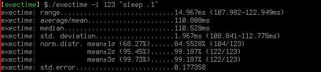

exectime
========

Console tool which executes a specific command while measuring execution time. The result is summarized using statistical calculations which can be used for performance testing or similar.

### Status
Current stable version: v0.0.3.

## Background
To be able to test performance of [dus](https://github.com/RiJo/dus) in parallel mode I was missing a quick and easy tool to calculate statistics of time consumed by a single application. Previously I was using bash's built-in `time` command. But I had to summarize the statistics (standard deviation etc) by myself and it's pretty cumbersome. Why do the math by oneself when the computer makes it faster and more consistently?

The intention is to also make this program a regression testing tool. One should be able to save the statistics from one run (old version) and compare it to another one (new version) to see if there's any difference in execution performance.

## Screenshot

## Usage
    // Time of a single command (oneshot)
    $ exectime sleep 1

    // Time statistics of command executed multiple times (here 100)
    $ exectime -i 100 "find / -name 'foo'"

## Compilation
Everything is written in C++14 and is simply compiled, installed and uninstalled using make.

## Releases
### v0.0.1
* Print summary with minimum, maximum, average, median, standard deviation and normal distribution values
* Ability to define number of iterations

### v0.0.2
* Fixed calculation rounding issues
* Code cleanup

### v0.0.3
* Fixed some compilation issues
* New parameters:  --cmp-stdout, --ref-stdout, --cmp-stderr and --ref-stderr

## License
This project is licensed under GPLv3.

